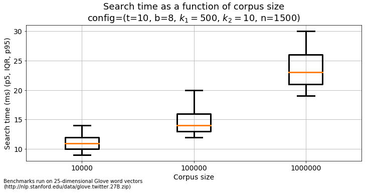
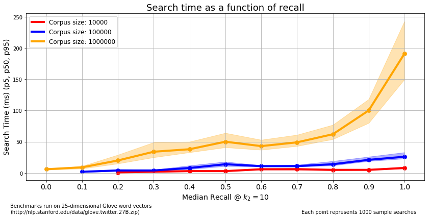
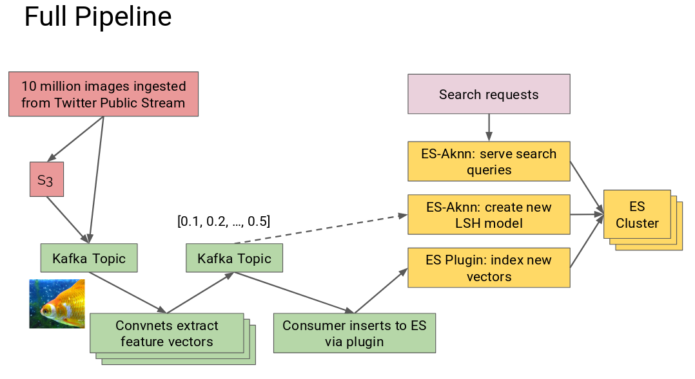

# ElastiK Nearest Neighbors

[Insight Data Engineering](https://www.insightdataengineering.com/) Project, Boston, April - June 2018

***


<small>Image similarity search demo running queries on a cluster of 4 Elasticsearch nodes</small>

## Overview

I built Elasticsearch-Aknn (EsAknn), an Elasticsearch plugin which implements 
approximate nearest neighbors search over dense, floating-point vectors in 
Elasticsearch. This allows data engineers to avoid rebuilding an infrastructure 
for large-scale KNN and instead leverage Elasticsearch's proven distributed 
infrastructure.

To demonstrate the plugin, I used it to implement an image similarity search 
engine for a corpus of 6.7 million Twitter images. I transformed each image 
into a 1000-dimensional floating-point feature vector using a convolutional 
neural network. I used EsAknn to store the vectors and search for nearest 
neighbors on an Elasticsearch cluster.

The repository is structured:

- `demo` directory: Twitter Image Similarity search pipeline and web-application
- `elasticsearch-aknn` directory: EsAknn implementation and benchmarks
- `scratch` directory: several smaller projects implemented while prototyping

## Demo

- [Web-application](http://ec2-18-204-52-148.compute-1.amazonaws.com:9999/twitter_images/twitter_image/demo) 
- [Screencast demo on Youtube](https://www.youtube.com/watch?v=HqvbbwmY-0c)
- [Presentation on Google Slides](https://docs.google.com/presentation/d/1kkzwM-m5KvpfQFhqCepnR45_Pqz4poxPLtpbs3C8cXA/edit?usp=sharing)

## Elasticsearch-Aknn

### Usecase

EsAknn is useful for problems roughly characterized:

1. Have a large corpus of feature vectors with dimensionality ~50-1000.
2. Need to run similarity searches using K-Nearest-Neighbors.
3. Need to scale horizontally to support many concurrent similarity searches.
4. Need to support a growing corpus with near-real-time insertions. I.e., 
when a new vector is created/ingested, it should be available for searching in 
less than 10 minutes.

### API

#### Create LSH Model

Given a sample of vectors, create a locality-sensitive-hashing (LSH) model 
and store it as an Elasticsearch document.

```
POST <elasticsearch host>:9200/_aknn_create 

{
    "_index":   "aknn_models",
    "_type":    "aknn_model",
    "_id":      "twitter_image_search",
    "_source": {
        "_aknn_description": "LSH model for Twitter image similarity search",
        "_aknn_nb_tables": 64,
        "_aknn_nb_bits_per_table": 18,
        "_aknn_nb_dimensions": 1000
    },
    "_aknn_vector_sample": [
        # Provide a sample of 2 * _aknn_nb_tables * _aknn_nb_bits_per_table vectors
        [0.11, 0.22, ...],
        [0.22, 0.33, ...],
        ...
        [0.88, 0.99, ...]
    ]
}
```

This returns:

```
{ "took": <number of milliseconds> }
```

#### Index New Vectors

Given a batch of new vectors, hash each vector using a pre-defined LSH model 
and store its raw and hashed values in an Elasticsearch document.

```
POST <elasticsearch host>:9200/_aknn_index

{
    "_index":       "twitter_images",
    "_type":        "twitter_image",
    "_aknn_uri":    "aknn_models/aknn_model/twitter_image_search"
    "_aknn_docs": [
        {
            "_id": 1,
            "_source": {
                "_aknn_vector": [0.12, 0.23, ...],

                # Any other fields you want...
            }
        }, ...
    ]
}
```

This returns:

```
{ "took": <number of milliseconds>, "size": <number of documents indexed> }
```

#### Similarity Search

Given a vector in the index, search for and return its nearest neighbors.

```
GET <elasticsearch host>:9200/twitter_images/twitter_image/1/_aknn_search?k1=1000&k2=10
```

This returns:

```
{
    "took": <number of milliseconds>,
    "timed_out": false,

    "hits": {
        "max_score": 0,
        "total": <number of hits returned, up to k2>,
        "hits": [
            {
                "_id": "...",
                '_index': "twitter_images",
                "_score": <euclidean distance from query vector to this vector>,
                '_source': {
                    # All of the document fields except for the potentially
                    # large fields containing the vector and hashes.
                }
            }, ...
        ]

    }

}
```

### Implementation

The key things to know about the implementation are:

1. EsAknn runs entirely in an existing Elasticsearch cluster/node.
2. Searches can run in parallel. New vectors can be indexed on multiple nodes 
in parallel using a round-robin strategy. Parallel indexing on a single node has
not been tested extensively.
3. EsAknn uses [Locality Sensitive Hashing](https://en.wikipedia.org/wiki/Locality-sensitive_hashing) 
to convert a floating-point vector into a discrete representation which can be 
efficiently indexed and retrieved in Elasticsearch.
4. EsAknn stores the LSH models and the vectors as standard documents.
5. EsAknn uses a [Bool Query](https://www.elastic.co/guide/en/elasticsearch/reference/current/query-dsl-bool-query.html) 
to find `k1` approximate nearest neighbors based on discrete hashes. It then 
computes the exact distance to each of these approximate neighbors and returns 
the `k2` closest. For example, you might set `k1 = 1000` and `k2 = 10`.
6. EsAknn currently only implements euclidean distance, but any distance
function compatible with LSH can be added.

### Performance

#### Speed

EsAknn's speed is generally characterized:

1. Create a new LSH model: < 1 minute.
2. Index new vectors: hundreds to low thousands per second.
3. Search for a vector's neighbors: < 500 milliseconds. Search time scales 
sub-linearly with the size of the corpus. 

The corpus vs. search time generally follows a sub-linear pattern like this:



Beyond that, speed is a function of:

1. The vectors' dimensionality.
2. The number of tables (a.k.a. hash functions or trees) in the LSH model.
3. The number of bits in the LSH model's hashes.
4. The number of approximate neighbors retrieved, `k1`. 
5. The number of exact neighbors returned, `k2`.

In the image similarity search engine, you can see that searches against an
index of 6.7 million 1000-dimensional vectors rarely exceed 200 milliseconds.

#### Recall

Recall is defined as the proportion of true nearest neighbors returned for
a search and can be evaluated at various values of `k2`. 

Similar to speed, recall depends on the LSH configuration. Increasing `k1` 
is typically the easiest way to increase recall, but the number of tables and 
bits also play an important role. Finding a configuration to maximize 
recall and minimize search time can be considered a form of hyper-parameter 
optimization.

The figure below demonstrates that it is possible to find a configuration 
with high-recall and low search-time at various corpus sizes. The points plotted
represent the "frontier" of recall/search-time. That is, I ran benchmarks on
many configurations and chose the configurations with the lowest median search 
time for each median recall across three corpus sizes.



The table below shows the best configuration for each combination of corpus size, 
median recall, median search time.

|    |   Corpus size |   Med. recall |   Med. search time |   k1 |   _aknn_nb_tables |   _aknn_nb_bits_per_table |
|----|---------------|---------------|--------------------|------|-------------------|---------------------------|
|  0 |       1000000 |          1    |                197 |  500 |               200 |                        12 |
|  1 |       1000000 |          0.9  |                110 |  500 |               100 |                        12 |
|  2 |       1000000 |          0.8  |                 65 | 1000 |                50 |                        12 |
|  3 |       1000000 |          0.7  |                 53 |  500 |                50 |                        12 |
|  4 |       1000000 |          0.6  |                 55 |  500 |                50 |                        20 |
|  5 |       1000000 |          0.4  |                 43 |  100 |                50 |                        12 |
|  6 |       1000000 |          0.3  |                 36 | 1000 |                10 |                         8 |
|  7 |       1000000 |          0.2  |                 20 |  500 |                10 |                        12 |
|  8 |       1000000 |          0.1  |                  9 |  100 |                10 |                        12 |
|  9 |       1000000 |          0    |                  7 |   15 |                10 |                        12 |
| 10 |        100000 |          1    |                 36 | 1000 |                50 |                        16 |
| 11 |        100000 |          0.9  |                 23 |  500 |                50 |                        16 |
| 12 |        100000 |          0.8  |                 26 |  500 |                50 |                        20 |
| 13 |        100000 |          0.7  |                 13 |  100 |                50 |                        16 |
| 14 |        100000 |          0.6  |                 16 |  100 |                50 |                        20 |
| 15 |        100000 |          0.5  |                 14 |  500 |                10 |                         8 |
| 16 |        100000 |          0.45 |                 24 |   15 |               100 |                        16 |
| 17 |        100000 |          0.4  |                 13 |   15 |                50 |                        12 |
| 18 |        100000 |          0.3  |                  4 |  100 |                10 |                        12 |
| 19 |        100000 |          0.2  |                  5 |  100 |                10 |                        16 |
| 20 |        100000 |          0.1  |                  2 |   15 |                10 |                        16 |
| 21 |         10000 |          1    |                  8 |  100 |               100 |                        12 |
| 22 |         10000 |          0.9  |                  5 |  100 |                50 |                        12 |
| 23 |         10000 |          0.8  |                  5 |  100 |                50 |                        20 |
| 24 |         10000 |          0.7  |                  7 |  500 |                10 |                        20 |
| 25 |         10000 |          0.6  |                  6 |   15 |               100 |                        16 |
| 26 |         10000 |          0.5  |                  3 |  100 |                10 |                        12 |
| 27 |         10000 |          0.4  |                  3 |   15 |                50 |                         8 |
| 28 |         10000 |          0.2  |                  1 |   15 |                10 |                        20 |


## Image Processing Pipeline

### Implementation



The image processing pipeline consists of the following components, shown in
pink and green above:

1. Python program ingests images from the Twitter public stream and stores in S3.
2. Python program publishes batches of references to images stored in S3 to a 
Kafka topic.
3. Python program consumes batches of image references, computes feature 
vectors from the images, stores them on S3, publishes references to Kafka. 
I use the `conv_pred` layer from 
[Keras pre-trained MobileNet](https://keras.io/applications/#mobilenet) 
to compute the 1000-dimensional feature vectors. 
4. Python program consumes image features from Kafka/S3 and indexes them in
Elasticsearch via EsAknn.

### Performance

Image feature extraction is the main bottleneck in this pipeline. It's 
embarrassingly parallel but still requires thoughtful optimization. In the end
I was able to compute:

1. 40 images / node / second on EC2 P2.xlarge (K80 GPU, $0.3/hr spot instance).
2. 33 images / node / second on EC2 C5.9xlarge (36-core CPU, $0.6/hr spot instance).

My first-pass plateaued at about 2 images / node / second. I was able to improve
throughput with the following optimizations:

1. Produce image references to Kafka instead of full images. This allows
many workers to download the images in parallel from S3. If you send the full
images through Kafka, it quickly becomes a bottleneck.
2. Workers use thread pools to download images in parallel from S3.
3. Workers use process pools to crop and resize images for use with Keras.
4. Workers use the [Lycon library](https://github.com/ethereon/lycon) for fast image resizing.
3. Workers use Keras/Tensorflow to compute feature vectors on large batches of 
images instead of single images. This is a standard deep learning optimization.

## Helpful Resources

Here are a handful of resources I found particularly helpful for this project:

1. [Locality Sensitive Hashing lectures by Victor Lavrenko](https://www.youtube.com/watch?v=Arni-zkqMBA)
2. [Elasticsearch Plugin Starter by Alexander Reelsen](https://github.com/spinscale/cookiecutter-elasticsearch-ingest-processor)
3. [Elasticsearch OpenNLP Plugin by Alexander Reelsen](https://github.com/spinscale/elasticsearch-ingest-opennlp)
4. Discussions about similarity search in Elasticsearch: [one](https://discuss.elastic.co/t/what-is-the-best-scheme-for-similarity-search-based-on-binary-codes-with-elasticsearch-context-is-image-search-with-deep-nets/42915/6), [two](https://stackoverflow.com/questions/32785803/similar-image-search-by-phash-distance-in-elasticsearch).
