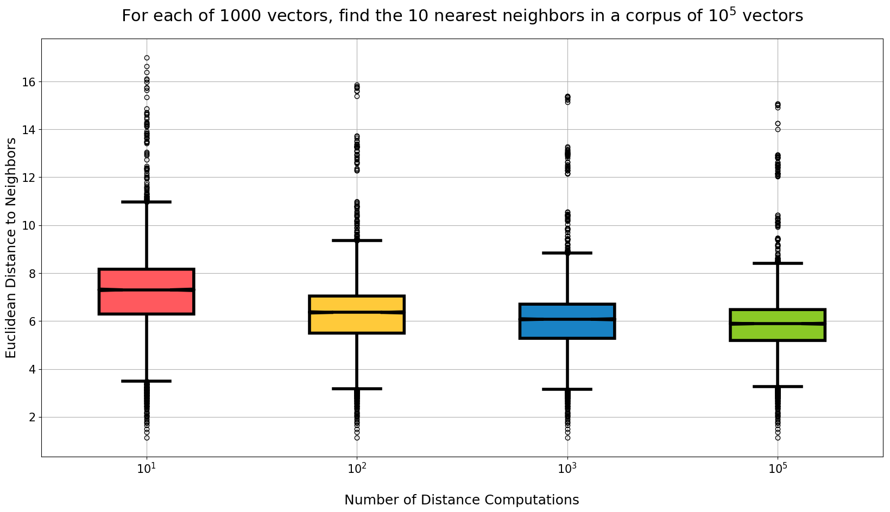

# Elasticsearch-Aknn Benchmarks



## Preprocess Glove Vectors

```
./glove_download.sh
python glove_preprocess.py glove.840B.300d.txt > glove.840B.300d.docs.txt
```

You can also use your own and vectors, but to use this CLI, the vectors must be 
contained in a single text document with format:

```
{"_id": "elasticsearch_compatible_document_id_0", "_source": {"_aknn_vector": [0.1, 0.2, ...], "any": "other", "key-value": "pairs you need"}}\n
```

For example, the preprocessed Glove vectors look like this:

```
{"_id": "I", "_source": {"description": "Word vector for: I", "_aknn_vector": [0.1941, 0.22603, ..., 0.11736]}}
{"_id": "that", "_source": {"description": "Word vector for: that", "_aknn_vector": [0.09852, 0.25001, ..., 0.17779]}}

```

## Create a new Aknn model from preprocessed Glove vectors

```
python -m aknn --es_hosts http://localhost:9200 create \
	glove.840B.300d.docs.txt \
	--es_index aknn_models \
	--es_type aknn_model \
	--es_id glove_840B_300d \
	--description "Aknn model for glove.840B.300d.txt" \
	--nb_dimensions 300 \
	--nb_tables 32 \
	--nb_bits 16
```

## Index a large collection of Glove vectors

```
python -m aknn --es_hosts http://localhost:9200 index \
	glove.840B.300d.docs.txt \
	index_metrics.csv \
	--aknn_uri aknn_models/aknn_model/glove_840B_300d \
	--es_index glove_word_vectors \
	--es_type glove_word_vector \
	--nb_batch 10000

```

## Test recall

This produces the plot shown above.

```
python -m aknn --es_hosts http://localhost:9200 recall \
	glove.840B.300d.docs.txt \
	./metrics \
	--es_index glove_word_vectors \
	--es_type glove_word_vector \
	--k1 10,100,1000 \
	--k2 10 \
	--nb_measured 1000

```

## Test concurrent search queries

```
# Not implemented yet.
# python -m aknn -h http://localhost:9200,http://localhost:9202 search \
# 	--index glove_word_vectors \
#	--type glove_word_vector \
#	--time 5 \
#	--threads 10
```