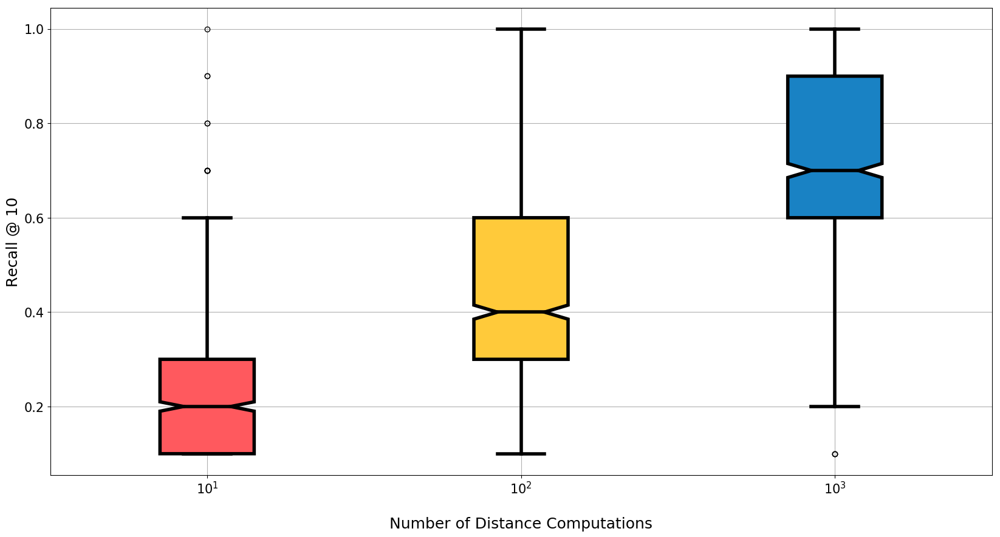

# Elasticsearch-Aknn Benchmarks



## Preprocess Glove Vectors

```
./glove_download.sh
python glove_preprocess.py glove.840B.300d.txt > glove.840B.300d.docs.txt
```

You can also use your own and vectors, but to use this CLI, the vectors must be 
contained in a single text document with format:

```
{"_id": "elasticsearch_compatible_document_id_0", "_source": {"_aknn_vector": [0.1, 0.2, ...], "any": "other", "key-value": "pairs you need"}}\n
```

For example, the preprocessed Glove vectors look like this:

```
{"_id": "I", "_source": {"description": "Word vector for: I", "_aknn_vector": [0.1941, 0.22603, ..., 0.11736]}}
{"_id": "that", "_source": {"description": "Word vector for: that", "_aknn_vector": [0.09852, 0.25001, ..., 0.17779]}}

```

## Set your Elasticsearch hosts as an environment variable

This makes the rest of the benchmarks a little less verbose.

```
export ESHOSTS=http://localhost:9200
```

## Create a new Aknn model from preprocessed Glove vectors

```
python3 aknn.py --es_hosts $ESHOSTS create \
	glove.840B.300d.docs.txt \
	--es_index aknn_models \
	--es_type aknn_model \
	--es_id glove_840B_300d \
	--description "Aknn model for glove.840B.300d.txt" \
	--nb_dimensions 300 \
	--nb_tables 32 \
	--nb_bits 32
```

## Index a large collection of Glove vectors

```
python3 aknn.py --es_hosts $ESHOSTS index \
	glove.840B.300d.docs.txt \
	metrics/indexing.csv \
	--aknn_uri aknn_models/aknn_model/glove_840B_300d \
	--es_index glove_word_vectors \
	--es_type glove_word_vector \
	--nb_batch 10000 \
	--nb_total_max 500000
```

```
...
Sending 10000 docs to host http://<es-host-0>:9200
Sending 10000 docs to host http://<es-host-1>:9200
Sending 10000 docs to host http://<es-host-2>:9200
Sending 10000 docs to host http://<es-host-3>:9200
Response from host http://<es-host-0>:9200: {'took': 12743, 'size': 10000}
Response from host http://<es-host-1>:9200: {'took': 12994, 'size': 10000}
Response from host http://<es-host-2>:9200: {'took': 14044, 'size': 10000}
Response from host http://<es-host-3>:9200: {'took': 14127, 'size': 10000}
Total indexed docs = 480000, seconds elapsed = 287
Sending 5000 docs to host http://<es-host-0>:9200
Sending 5000 docs to host http://<es-host-1>:9200
Sending 5000 docs to host http://<es-host-2>:9200
Sending 5000 docs to host http://<es-host-3>:9200
Response from host http://<es-host-0>:9200: {'took': 5836, 'size': 5000}
Response from host http://<es-host-1>:9200: {'took': 6058, 'size': 5000}
Response from host http://<es-host-2>:9200: {'took': 6302, 'size': 5000}
Response from host http://<es-host-3>:9200: {'took': 6941, 'size': 5000}
Total indexed docs = 500000, seconds elapsed = 303
```

## Test recall

This produces the plot shown above.

```
python3 aknn.py --es_hosts $ESHOSTS recall \
	glove.840B.300d.docs.txt \
	./metrics \
	--es_index glove_word_vectors \
	--es_type glove_word_vector \
	--k1 10,100,1000 \
	--k2 10 \
	--nb_measured 1000
```

## Test concurrent search queries

```
python3 aknn.py --es_hosts $ESHOSTS search \
	metrics/search_glove_500k.csv \
 	--index glove_word_vectors \
	--type glove_word_vector \
	--nb_workers 100 \
	--nb_requests 100
```